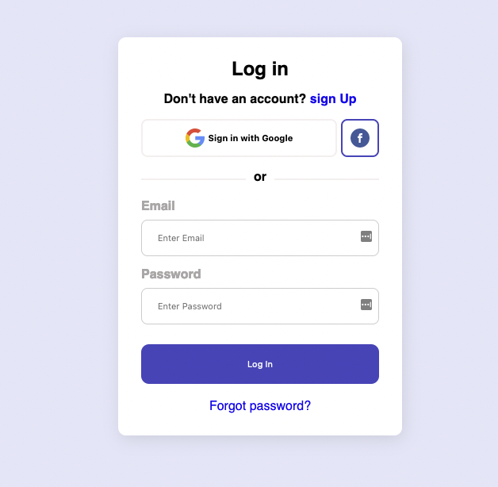

# proyecto-html
Por Bruna Sonda e Iris Sánchez

# ¿Dónde está mi HTML?

### Explicación del Proyecto

**Nuestro diseñador UX nos ha dado el diseño UI de una parte importante de nuestra página web, el *log in*, vamos a estructurar solamente el código HTML. No hagas hagas nada de CSS.**

**¿Qué vamos a hacer?**

Vamos a crear la estructura HTML de un formulario de Log In siguiendo un diseño UI proporcionado.

**¿Dónde lo vamos a hacer?**

Trabajaremos en un archivo HTML que se guardará dentro de una carpeta específica.

**¿Cómo lo hacemos?**

Usaremos etiquetas semánticas de HTML5 para estructurar el contenido, prestando atención a cómo se organizan las “cajas” o elementos para que otro desarrollador pueda agregar estilos CSS posteriormente.

**¿Con qué lo hacemos?**

Utilizaremos HTML5 y un editor de texto como Visual Studio Code. No se permite el uso de CSS, solo HTML.

**¿Cómo se evalúa lo que hacemos?**

El proyecto será evaluado en función de la estructura y semántica del HTML, así como en la organización clara y lógica de los elementos de la página.

---

### **Objetivo del Proyecto**

En esta **actividad en pair-programming**, el objetivo principal es **crear la estructura HTML para un formulario de Log In**, aplicando diferentes niveles de comprensión sobre la maquetación web, además de practicar subir el proyecto a un repositorio de GitHub. Se debe aplicar las prácticas de git y gitflow

---

### **Paso a Paso**

**Paso 1: Crear la Carpeta del Proyecto**

- Crea una carpeta llamada `donde-esta-mi-html` en tu ordenador donde vas a guardar todos los archivos del proyecto.

**Paso 2: Crear el Archivo HTML**

- Dentro de la carpeta `donde-esta-mi-html`, crea un archivo llamado `index.html`.

**Paso 3: Estructurar el Contenido en el Archivo HTML**

1. **Inicia el archivo HTML** con la estructura básica de un documento HTML5:
2. **Crear el contenedor principal** (`
`) o otra etiqueta mas semántica, que servirá como la "caja" principal del formulario.
3. **Crear el formulario** (`<form>`) dentro del contenedor principal para alojar los campos de entrada y los botones.
4. **Agregar los botones de inicio de sesión social dentro de la etiqueta form** utilizando etiquetas de botón (`<button>`) y etiquetas de imagen (``).
5. **Añadir una línea de separación** (`
or
`) entre el inicio de sesión social y la entrada manual de datos.
6. **Crear la sección de inicio de sesión con correo y contraseña** (`
`) con campos de entrada para email y contraseña utilizando las etiquetas input.
7. **Agregar un botón de envío** (`<button>Log In</button>`) y un enlace para la recuperación de contraseña (`<a href="#">Forgot password?</a>`).
8. **Cerrar el formulario y la estructura HTML**

**Paso 4: Guardar y Revisar**

- Guarda todos los cambios en el archivo `index.html` y revisa que el HTML se haya estructurado correctamente siguiendo las instrucciones dadas.

---

### Recursos y Herramientas

- **Editor de Texto**: [Visual Studio Code](https://code.visualstudio.com/)
- **Documentación HTML**:
    - [Getting started with HTML](https://developer.mozilla.org/en-US/docs/Learn/HTML/Introduction_to_HTML/Getting_started)
    - [HTML: Lenguaje de etiquetas de hipertexto](https://developer.mozilla.org/es/docs/Web/HTML)
    - [Tabla periódica de HTML5](https://lenguajehtml.com/html/introduccion/tabla-periodica-html5/)
    - [Building your first web page](https://learn.shayhowe.com/html-css/building-your-first-web-page/)

---

### Entrega

- **Formato de entrega**:
    - Entragar el enlace de ropositorio de github hasta el 11/04.

---

Este proyecto te permitirá familiarizarte con la estructura de ‘cajas’ (contenedores) de HTML y la organización lógica del contenido en una página web, preparando la base para futuras aplicaciones de estilo y diseño.

**¿Cómo sabrás si el proyecto es correcto?** Ya lo veremos más adelante…

⛔️ Prohibido usar CSS. Sólo podemos hacer el HTML.