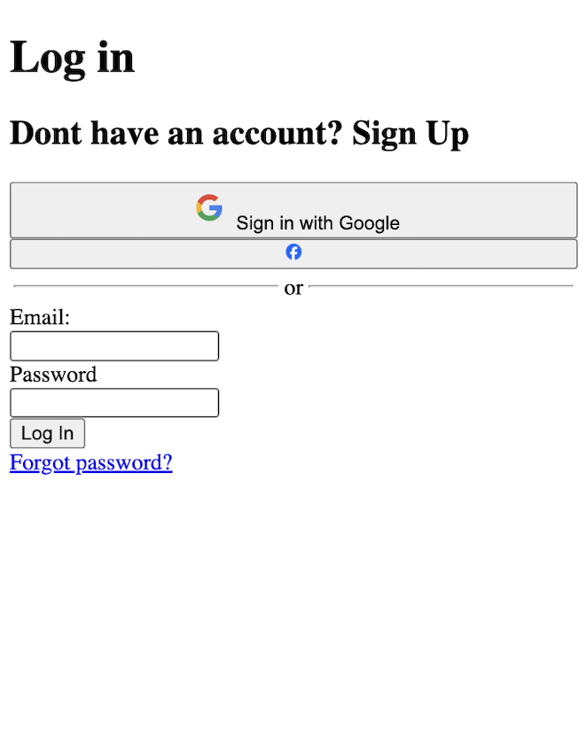

# 📝 Where is my HTML?

This is an HTML project for the FemCoders Bootcamp.\
➡️ Web development- Frontend

## 💡 Project Description

Our UX designer has provided us with the UI design for a key part of our website: the *log in* page. We are only going to structure the HTML code. 

### 📌 Main task

We will create the HTML structure of a Log In form based on a given UI design.  

### 📂 Working space

We will work on an HTML file that will be saved inside a specific folder.

### ℹ️ Detailed directions

We’ll use semantic HTML5 tags to structure the content, paying attention to how the “boxes” or elements are organized, so that another developer can later add CSS styles.
>🚫 Do not add any CSS

### 🛠️ Tools

- HTML5 &emsp;  
- A text editor like Visual Studio Code &emsp; 

### 📊 Evaluation

The project will be evaluated based on:

- The structure and semantics of the HTML.
- The clear and logical organization of the page elements.

## 🎯 Project Goal

In this **pair-programming activity**, the main goal is to **create the HTML structure for a Log In form**, applying different levels of understanding of web layout.  
Moreover, you’ll practice pushing the project to a GitHub repository, while applying **Git** and **Gitflow** best practices.

## 📷 Preview

## 🤝  Team Members

- [Bruna Sonda](https://github.com/brunasonda)  
- [Iris Sánchez](https://github.com/isanort)